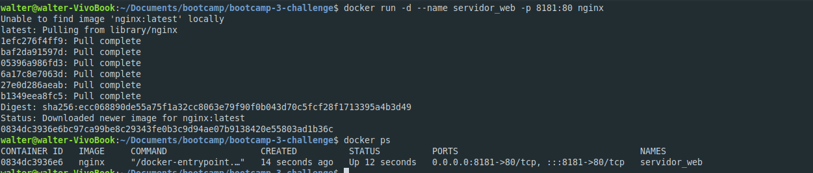
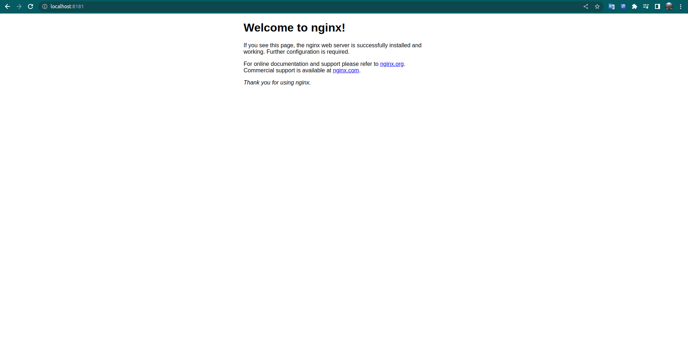

# Documentacion 
## Creacion del contenedor
`` docker run -d --name servidor_web -p 8181:80 nginx ``

## Web de nginx

## Listado de imagenes 

## Se detiene el contenedor, se elimina y se verifica
