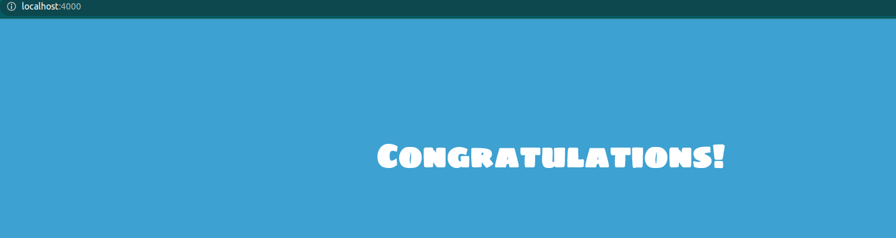

# solucion reto 05
## Prueba local
Tener previamente instalado nodejs

Nos paramos dentro del directorio hello-bootcamp, ejecutamos el siguiente comando: 

``
npm install
``

Para probar la app en tu local

``
node server.js
``

Ingresa en el navegado en localhost:4000 

# Generacion Dockerfile
Origen del contenedor

`` FROM node:lts-alpine3.16 ``

Creamos una carpeta app en el / del contenedor

`` RUN mkdir -p /app``

Nos posicionamos en el directorio app

`` WORKDIR /app ``

Copiamos el package.json del directorio hello-bootcamp

`` COPY hello-bootcamp/package*.json ./ ``

Ejecutamos install con npm para instalar todos los paquetes necesarios

`` RUN npm install `` 

Copiamos el contenido del directorio hello-bootcamp 

`` COPY hello-bootcamp/. . ``

Exponemos el puerto 4000 de nuestro contenedor

`` EXPOSE 4000 ``

Por ultimo ejecutamos CMD para que cuando se inicie el contenedor corra server.js

`` CMD ["node", "server.js"] ``

Url del registry: 

https://hub.docker.com/repository/docker/walterh91/nodeappreto05